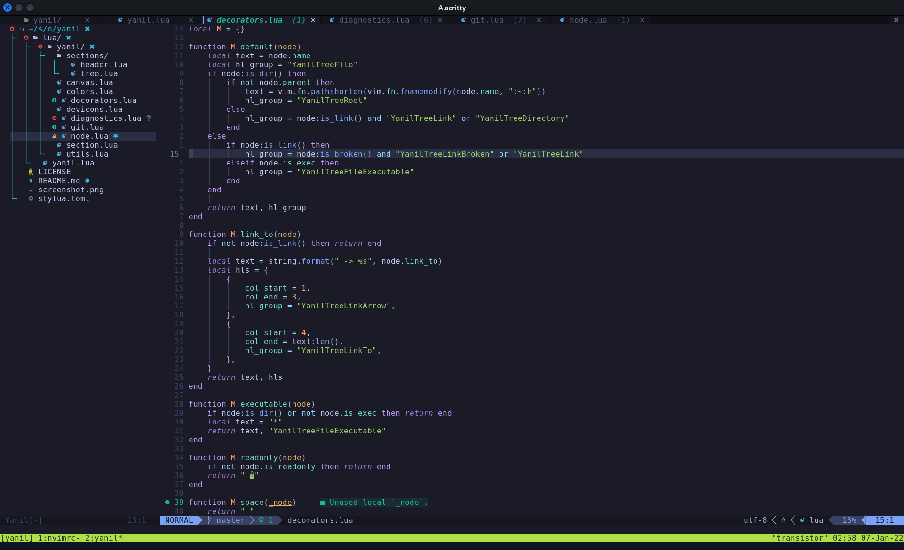

# Yanil

Yet Another Nerdtree In Lua

This not an out-of-box nerdtree alternative (and won't be), but a lib to build your own nerdtree.



## Prerequisites

- `neovim-0.6.0`
- A patched font, you can easily get one from [nerd fonts](https://github.com/ryanoasis/nerd-fonts).

## Installation

```lua
use({
	"FotiadisM/yanil",
	requires = { "kyazdani42/nvim-web-devicons", "nvim-lua/plenary.nvim" },
	config = function()
		require("plugins.yanil")
	end,
})

```

## Setup

```lua
local canvas = require("yanil.canvas")
local git = require("yanil.git")
local decorators = require("yanil.decorators")
local diagnostics = require("yanil.diagnostics")
local devicons = require("yanil.devicons")
local colors = require("yanil.colors")

colors.setup()
diagnostics.setup()
git.setup()

local tree = require("yanil.sections.tree"):new()

tree:setup({
	draw_opts = {
		decorators = {
			decorators.pretty_indent,
			diagnostics.decorator(),
			decorators.space,
			devicons.decorator(),
			decorators.space,
			decorators.default,
			decorators.space,
			git.decorator(),
		},
	},
	keymaps = {
		["<CR>"] = tree.open_node,
		["<BS>"] = tree.close_node,

		l = tree.open_node,
		h = tree.close_node,
		v = tree:gen_open_file_node("vsplit"),
		s = tree:gen_open_file_node("split"),

		a = tree.create_node,
		d = tree.delete_node,
		r = tree.rename_node,

		["]c"] = git.jump_next,
		["[c"] = git.jump_prev,

		C = tree.cd_to_node,
		U = tree.cd_to_parent,
		K = tree.go_to_first_child,
		J = tree.go_to_last_child,

		R = tree.force_refresh_tree,
		q = function()
			vim.fn.execute("quit")
		end,
	},
	filters = {
		function(name)
			local patterns = { "^%.git$" }
			for _, pat in ipairs(patterns) do
				if string.find(name, pat) then
					return true
				end
			end
		end,
	},
})

canvas.register_hooks({
	on_enter = function()
		git.update(tree.cwd)
	end,
})

canvas.setup({
	sections = {
		tree,
	},
	autocmds = {
		{
			event = "User",
			pattern = "YanilGitStatusChanged",
			cmd = function()
				git.refresh_tree(tree)
			end,
		},
		{
			event = "DiagnosticChanged",
			pattern = "*",
			cmd = function()
				diagnostics.update()
				diagnostics.refresh_tree(tree)
			end,
		},
	},
})


vim.api.nvim_set_keymap("n", "<leader>b", ":lua require('yanil.canvas').toggle()<CR>", { silent = true })

```

## Note

This plugin is in very early stages and has no backward compatibility guarantees.

### Known issues

- Not support for windows
- Not support for multi tabs
- Only supports nvim-0.6 vim.diagnostics

## Credits

- [nerdtree](https://github.com/preservim/nerdtree): It's one of the greatest vim plugin.
- [nvim-tree.lua](https://github.com/kyazdani42/nvim-tree.lua): I learned a lot from it in prototype stage.
